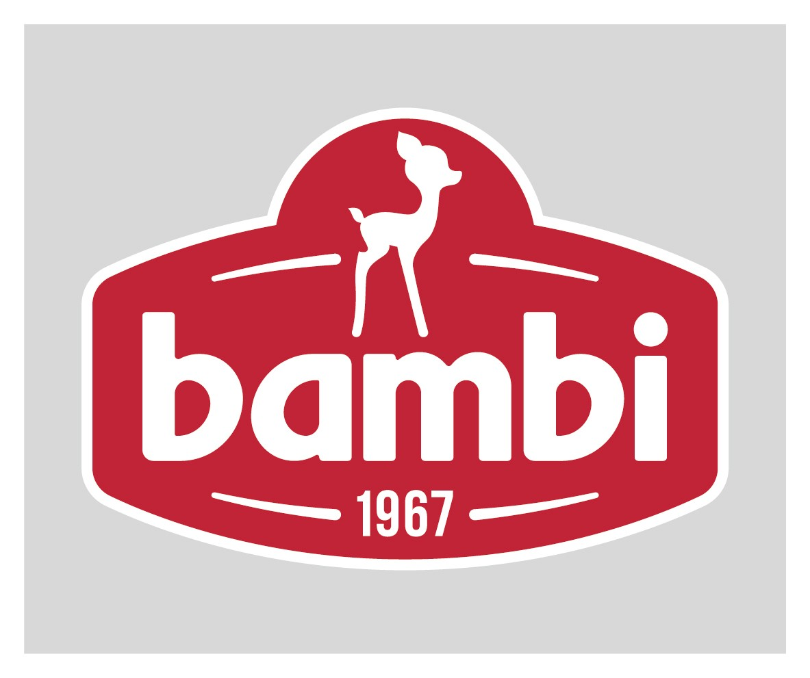

<p align="center">
  <a href="https://bambi.rs/" target="blank"></a>
</p>

<p align="center">API for product catalog for Koncern Bambi a.d.</p>

## Run API

```bash
# build docker container
$ sudo docker-compose build

# run container
$ sudo docker-compose up
```

## Tools used in development:

- [TypeScript](https://www.typescriptlang.org/)
- [NestJS](https://nestjs.com/)
- [MongoDB](https://www.mongodb.com/)
- [Git](https://git-scm.com/)
- [GitHub](https://github.com/)
- [Docker](https://www.docker.com/)
- [Postman](https://www.postman.com/)


## Documentation:

```bash
$ npx @compodoc/compodoc -p tsconfig.json -s
```
## Database:

### Register structure

**firstName**:  Optional string, represents users first name<br>
**lastName**: Optional string, represents users last name<br>
**dateOfBirth**: Optional string, represents users date of birth<br>
**username**: Optional string, represents username<br>
**password**: Optional string, represents users password<br>
**email**: Optional string, represents users email<br>

### Login structure

**username**: Optional string, represents username<br>
**password**: Optional string, represents users password<br>

### Admin structure

**id**:             Optional string, represents uniqe identificator<br>
**productCode**:    Optional string, represents code of product that is commented<br>
**visitorNick**:    Optional string, represents nick of current visitor<br>
**anyContactData**: Optional string, represents any contact that visitor wants to give<br>
**aproved**:        Optional boolean, true if comment is aproved, false otherwise<br>

### Product structure (productClass)

**id**:    String, represents product class id<br>
**title**: String, represents product class title<br>

### Products (product with all details)

**&#95;id**: Optional string, database primary key (if not given, generated automaticly)<br>
**id**: Optional string, product id<br>
**productCode**: Optional string, represents product code<br>
**productName**: Optional string, represents product name<br>
**foreignNames**: ForeignNames array:<br>
&nbsp;&nbsp;&nbsp;&nbsp;- **countryCode**: Optional string, represents product country code<br>
&nbsp;&nbsp;&nbsp;&nbsp;- **name**: Optional string, represents product name<br>

**productClass**: ProductClass object:<br>
&nbsp;&nbsp;&nbsp;&nbsp;- **id**: Optional string, represents uniq identificator<br>
&nbsp;&nbsp;&nbsp;&nbsp;- **title**: Optional string, represents product class title<br>

**active**: Optional boolean, true if product is active, false otherwise<br>
**thumbnail**: Thumbnail object:<br>
&nbsp;&nbsp;&nbsp;&nbsp;- **id**: Optional string, thumbnail id<br>
&nbsp;&nbsp;&nbsp;&nbsp;- **imageName**: Optional string, represents image name<br>

**images**: Images array:<br>
&nbsp;&nbsp;&nbsp;&nbsp;- **id**: Optional string, represents image id<br>
&nbsp;&nbsp;&nbsp;&nbsp;- **imageName**: Optional string, represents image name<br>

**unit**: Optional string, represents product unit (eg. 'kom')<br>
**eANCode**: Optional string, represents product EAN code<br>
**eANPackageCode**: Optional string, represents product EAN package code<br>
**logisticsData**: LogisticsData array:<br>
&nbsp;&nbsp;&nbsp;&nbsp;- **key**: Optional string, represents logistics key<br>
&nbsp;&nbsp;&nbsp;&nbsp;- **prompt**: Optional string, represents logistics prompt<br>
&nbsp;&nbsp;&nbsp;&nbsp;- **value**: Optional number, represents logistics value<br>

**tags**: Optional string array of tags<br>
**CustomAttributest**: CustomAttributes array:<br>
&nbsp;&nbsp;&nbsp;&nbsp;- **key**: Optional string, custom attributes key<br>
&nbsp;&nbsp;&nbsp;&nbsp;- **prompt**: Optional string, custom attributest prompt<br>
&nbsp;&nbsp;&nbsp;&nbsp;- **value**: Optional boolean, custom attributes value<br>

**likes**: Optional number, represents product likes<br>
**description**: Optional stgring, represents product descitption<br>


## Author

- [Jovana Jovanović](https://github.com/jjovana314)
